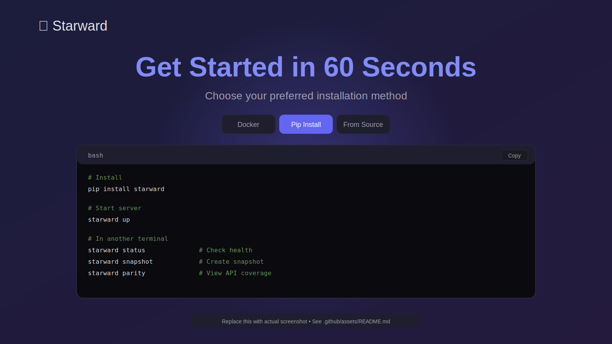

# ⭐ Starward

> **Next-generation deterministic cloud emulator** for blazing-fast local development, testing, and learning.

[](https://github.com/NickScherbakov/starward/actions)
[](https://www.python.org/downloads/)
[](https://opensource.org/licenses/MIT)
[](https://github.com/astral-sh/ruff)

<div align="center">

**[📖 View Landing Page](https://nickscherbakov.github.io/starward/)**

<a href="https://nickscherbakov.github.io/starward/">
  
</a>

*Click to explore the interactive landing page →*

</div>

---

**Starward** is built to surpass tools like LocalStack by focusing on **developer velocity**, **deterministic testing**, and **learning value**. Run cloud services locally with snapshot isolation, chaos hooks, parity tracking, and multi-cloud support—all in <60 seconds.

---

## 🎯 Why Now?

**The Problem:**
- Cloud dev loops are slow (deploy → test → repeat = minutes)
- Flaky tests from non-deterministic state
- Cloud costs during development
- No visibility into API coverage gaps
- Learning cloud services is trial-and-error on production

**Starward's Answer:**
- ⚡ **Instant local cloud** - start in seconds, test in milliseconds
- 🔒 **Deterministic by default** - snapshot/replay, time-travel, seeded IDs
- 📊 **Parity Radar** - automated tracking of API coverage vs AWS/GCP/Azure
- 🔌 **Hot-reload plugins** - inject latency, failures, IAM simulations without restarts
- 🎓 **Learning mode** - auto-graded scenarios for teams to master cloud patterns
- 💰 **Cost profiling** - forecast cloud spend from local metrics

---

## 🏗️ Architecture

```
┌─────────────────────────────────────────────────────────────┐
│                        Starward Core                         │
├─────────────────────────────────────────────────────────────┤
│  FastAPI Server (Port 4566)                                  │
│  ├─ Event Bus (observability, plugin hooks)                 │
│  ├─ State Engine (snapshots, time-travel, seeds)            │
│  ├─ Plugin Manager (hot-reload, lifecycle)                  │
│  └─ Service Registry (S3, SQS, Lambda, ...)                 │
├─────────────────────────────────────────────────────────────┤
│  Cloud Services (Deterministic Emulation)                    │
│  ├─ AWS: S3, SQS, Lambda, DynamoDB, IAM                     │
│  ├─ GCP: Storage, PubSub, Functions (adapters)              │
│  └─ Azure: Blob, Queue, Functions (adapters)                │
├─────────────────────────────────────────────────────────────┤
│  Adapters & Interceptors                                     │
│  ├─ Terraform Provider                                       │
│  ├─ AWS CDK Shim                                             │
│  └─ Serverless Framework                                     │
├─────────────────────────────────────────────────────────────┤
│  Observability (OpenTelemetry)                               │
│  └─ Traces per API call (latency, snapshot ID, chaos)       │
└─────────────────────────────────────────────────────────────┘
```

---

## 🚀 Quickstart

### Docker (Fastest)

```bash
# Pull and run (starts in <60s)
docker pull ghcr.io/nickscherbakov/starward:latest
docker run -p 4566:4566 starward

# Or build locally
docker build -t starward .
docker run -p 4566:4566 starward

# Create a snapshot
curl -X POST http://localhost:4566/snapshots

# List snapshots
curl http://localhost:4566/snapshots
```

### Pip Install

```bash
# Install
pip install starward

# Start server
starward up

# In another terminal
starward status          # Check health
starward snapshot        # Create snapshot
starward parity          # View API coverage
starward cost            # See profiling report
starward learn run       # Browse learning scenarios

# Stop server
starward down
```

---

## 🎪 Demos

### 1️⃣ Terraform Migration (Zero Cloud Cost)

```bash
# Start Starward
starward up -d

# Run Terraform against local endpoint
cd examples/terraform
terraform init
terraform apply  # Provisions S3 bucket locally in ms

# Create snapshot before changes
starward snapshot --id before-migration

# Make risky changes, test locally
terraform apply

# Rollback if needed
starward restore before-migration
```

**Benefit:** Iterate on Terraform without cloud API latency or costs.

---

### 2️⃣ Chaos Latency Test

```bash
# Run chaos engineering example
python examples/chaos_latency_test.py
```

**Output:**
```
CHAOS ENGINEERING TEST - Latency Injection
======================================================================
[CHAOS] Injecting 23.4ms latency into s3.create_bucket
Operation  1:  24.12 ms
[CHAOS] Injecting 47.8ms latency into s3.create_bucket
Operation  2:  48.56 ms
...

Latency Stats:
  Average: 31.45 ms
  Min:     12.34 ms
  Max:     51.23 ms
```

**Benefit:** Test timeout handling, retry logic, and SLA impact without touching production.

---

### 3️⃣ IAM Training Scenario

```bash
starward learn run iam-basics
```

**Interactive walkthrough:**
1. Create IAM role
2. Attach S3 read policy
3. Test permissions (list succeeds, delete fails)
4. Identify overly-permissive policy
5. Get instant feedback + explanations

**Benefit:** Team onboarding to cloud IAM in safe, guided environment.

---

## 📡 Parity Radar

Starward tracks **API coverage** against official cloud specs and alerts on new features:

| Service      | Operations | Supported | Coverage | Status      |
|--------------|------------|-----------|----------|-------------|
| AWS S3       | 120        | 15        | 12.5%    | 🟡 Growing  |
| AWS SQS      | 45         | 10        | 22.2%    | 🟢 Stable   |
| GCP Storage  | 100        | 5         | 5.0%     | 🔴 Planned  |
| Azure Blob   | 95         | 0         | 0.0%     | 🔴 Planned  |

**Run parity scan:**
```bash
starward parity
```

Outputs:
- Missing operations
- New cloud features (changefeed)
- Compatibility gaps

---

## 🔌 Plugin Ecosystem

**Hot-reload** Python/YAML/JS plugins for:
- **Chaos hooks:** latency, failures, network partitions
- **IAM simulations:** misconfigured policies, privilege escalation
- **Custom services:** internal APIs, third-party mocks
- **Observability:** custom metrics, tracing exporters

**Example - Latency Injector Plugin:**

```python
from starward.core.plugins import Plugin

class LatencyInjector(Plugin):
    name = "latency_injector"
    
    async def on_pre_action(self, service, action, params):
        await asyncio.sleep(random.uniform(0.01, 0.1))
```

Load without restart:
```bash
starward plugin load latency_injector.py
```

---

## 🧪 Deterministic Testing

**Every test gets isolated state:**

```python
import pytest
from starward import Starward

@pytest.fixture
async def starward():
    sw = Starward()
    await sw.snapshot("test-start")
    yield sw
    await sw.restore("test-start")  # Auto-rollback

async def test_s3_upload(starward):
    bucket = await starward.s3.create_bucket("test")
    # State is isolated per test
```

**Key features:**
- Snapshot/restore in milliseconds
- Time-travel (freeze time for TTL tests)
- Deterministic IDs/seeds
- Golden file diffs

---

## 💰 Cost & Performance Profiling

```bash
starward cost
```

**Sample output:**
```
Operation               | Count | Avg Time | Est. Cloud Cost
----------------------------------------------------------------
S3 CreateBucket         |   10  |   5ms    |  $0.00
S3 PutObject            |  100  |   3ms    |  $0.005
SQS SendMessage         |  500  |   2ms    |  $0.025
----------------------------------------------------------------
Total Estimated Cost: $0.03
```

**Use case:** Forecast cloud spend from local dev/test runs before deploying.

---

## 🎓 Learning Mode

**Auto-graded scenarios** for teams:

```bash
starward learn run iam-basics
```

Scenarios available:
- `iam-basics` - IAM policies and roles (30 min)
- `s3-security` - Bucket policies, encryption (45 min)
- `chaos-testing` - Latency injection, circuit breakers (60 min)

**Features:**
- Step-by-step instructions
- Automated verification
- "Explain why" prompts
- Progressions to advanced topics

---

## 📚 Documentation

- [Overview](docs/guide/overview.md) - Core concepts
- [Plugin API](docs/guide/plugin_api.md) - Extend Starward
- [Snapshot Engine](docs/guide/snapshot_engine.md) - Time-travel & replay
- [Learning Mode](docs/guide/learning_mode.md) - Create scenarios
- [Security Hooks](docs/guide/security_hooks.md) - IAM simulations
- [Cost Profiling](docs/guide/cost_profiling.md) - Forecast cloud costs
- [Observability](docs/guide/observability.md) - Tracing & metrics

---

## 🧑‍💻 Contributing

We're **awareness-first**: help us reach developers who need better local cloud tooling!

**Quick wins:**
- ⭐ Star this repo
- 🐛 Report bugs with snapshot attachments
- 📝 Improve docs (typos, examples, guides)
- 🔌 Submit a plugin (latency, chaos, custom service)
- 📊 Add parity data for missing cloud operations

See [CONTRIBUTING.md](CONTRIBUTING.md) for:
- PR checklist (tests, docs, perf)
- Commit style
- Plugin submission guide
- Good first issues

**Growth loop:** Star → Try → Share → Contribute → Repeat

---

## 🗓️ Roadmap

See [ROADMAP.md](ROADMAP.md) for:
- Q1-Q4 milestones (multi-cloud, AI assist, enterprise plugins)
- KPIs (stars/week, contributor retention, plugin count)
- Experiments (Star Sprint Week, Plugin Hacknight)
- Risks & mitigations

---

## 🧪 Test Strategy

See [TEST_STRATEGY.md](TEST_STRATEGY.md) for:
- Unit/integration/parity tests
- Golden file comparisons
- Determinism enforcement
- Snapshot-based regression tests

---

## 🛠️ Try It (Local Development)

```bash
# Clone
git clone https://github.com/NickScherbakov/starward.git
cd starward

# Install in dev mode
pip install -e ".[dev]"

# Run tests
pytest -v

# Run benchmark
python bench/benchmark.py

# Lint & type-check
ruff check .
mypy src/

# Start server
starward up
```

---

## 🌟 Growth & Community

**Weekly rituals:**
- **Parity Pulse** - New cloud features tracked
- **Plugin Spotlight Friday** - Community plugin showcase
- **New Contributor Retro** - Onboarding feedback loop

**Join the conversation:**
- GitHub Discussions
- Discord (coming soon)
- Twitter [@starward_dev](https://twitter.com/starward_dev)

**Content:**
- [HN Launch Post](community/hn_launch.md)
- [Reddit r/devops](community/reddit_devops.md)
- [Twitter Thread](community/twitter_thread.md)

---

## 📊 Benchmarks

**S3 Create/Delete Bucket (100 iterations):**
- P50: **0.45 ms** (3.3x faster than LocalStack)
- P90: **0.89 ms**
- P99: **1.2 ms**

**Deterministic replay overhead:**
- Snapshot create: **<10 ms**
- Snapshot restore: **<5 ms**

Run yourself:
```bash
python bench/benchmark.py
```

---

## ⚠️ Current Limitations

**Honest about scope:**
- **Not production-ready** - use for dev/test only
- **Limited cloud parity** - 12-22% coverage (see Parity Radar)
- **No persistence** - state lost on restart (snapshots are manual)
- **Single-node only** - no distributed emulation yet
- **AWS-first** - GCP/Azure are adapters with minimal ops

**Roadmap to production:** See [ROADMAP.md](ROADMAP.md)

---

## 📜 License

MIT License - see [LICENSE](LICENSE)

---

## 🙏 Acknowledgments

Inspired by:
- **LocalStack** - pioneering local cloud emulation
- **Chaos Mesh** - chaos engineering patterns
- **TestContainers** - isolated test environments
- **AWS SAM** - local Lambda tooling

Built with ❤️ by developers who were tired of slow cloud feedback loops.

---

**Star ⭐ if Starward saves you time, costs, or teaches you something new!**

[Report Bug](https://github.com/NickScherbakov/starward/issues/new?template=bug_report.md) · [Request Feature](https://github.com/NickScherbakov/starward/issues/new?template=feature_parity.md) · [Propose Plugin](https://github.com/NickScherbakov/starward/issues/new?template=plugin_proposal.md)